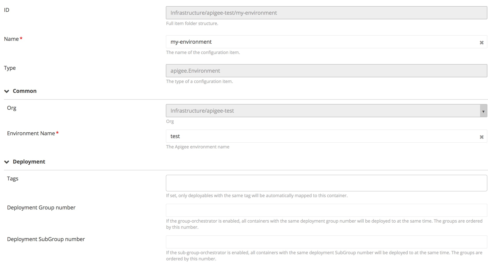
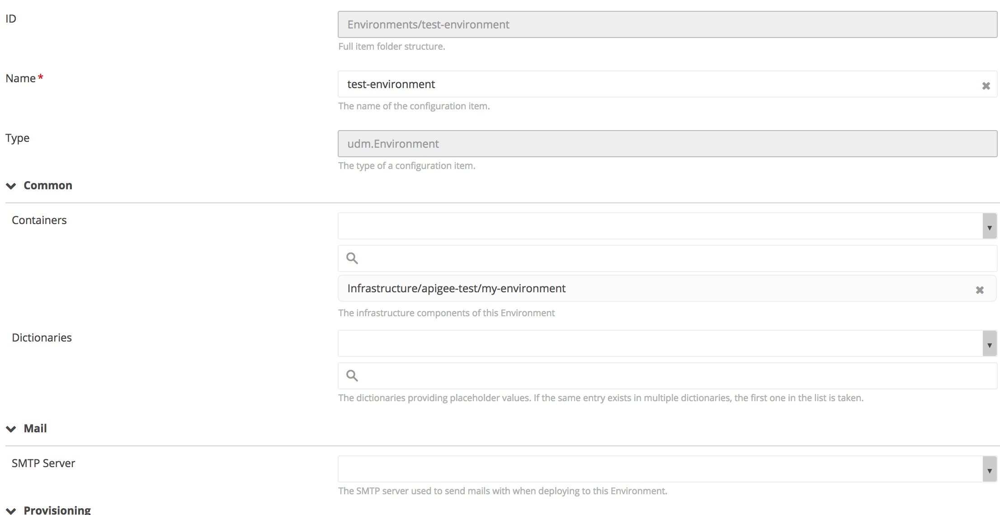
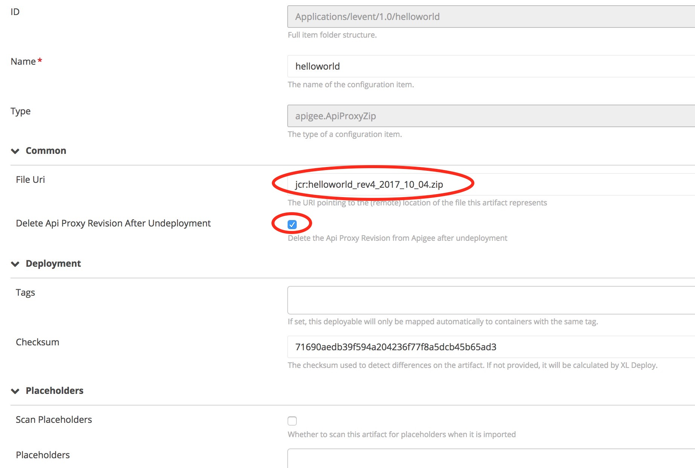

# XL Deploy Apigee plugin

[![Build Status][xld-apigee-plugin-travis-image] ][xld-apigee-plugin-travis-url]
[![Codacy Badge][xld-apigee-plugin-codacy-image] ][xld-apigee-plugin-codacy-url]
[![Code Climate][xld-apigee-plugin-code-climate-image] ][xld-apigee-plugin-code-climate-url]
[![License: MIT][xld-apigee-plugin-license-image] ][xld-apigee-plugin-license-url]
[![Github All Releases][xld-apigee-plugin-downloads-image] ]()

[xld-apigee-plugin-travis-image]: https://travis-ci.org/xebialabs-community/xld-apigee-plugin.svg?branch=master
[xld-apigee-plugin-travis-url]: https://travis-ci.org/xebialabs-community/xld-apigee-plugin
[xld-apigee-plugin-codacy-image]: https://api.codacy.com/project/badge/Grade/db7f22096a014ff0974def7351b21d73    
[xld-apigee-plugin-codacy-url]: https://www.codacy.com/app/ltutar/xld-apigee-plugin
[xld-apigee-plugin-code-climate-image]: https://codeclimate.com/github/ltutar/xld-apigee-plugin/badges/gpa.svg
[xld-apigee-plugin-code-climate-url]: https://codeclimate.com/github/ltutar/xld-apigee-plugin
[xld-apigee-plugin-license-image]: https://img.shields.io/badge/License-MIT-yellow.svg
[xld-apigee-plugin-license-url]: https://opensource.org/licenses/MIT
[xld-apigee-plugin-downloads-image]: https://img.shields.io/github/downloads/xebialabs-community/xld-apigee-plugin/total.svg

## Preface

This document describes the functionality provided by the Apigee plugin.

See the [XL Deploy reference manual](https://docs.xebialabs.com/xl-deploy) for background information on XL Deploy and deployment automation concepts.  

## Overview

The Apigee plugin is a XL Deploy plugin that adds capability for deploying applications to an Apigee environment within an Apigee Organization.

## Requirements

* **Requirements**
	* **XL Deploy** 7.0.1+

## Installation

* Copy the latest JAR file from the [releases page](https://github.com/xebialabs-community/xld-apigee-plugin/releases) into the `XL_DEPLOY_SERVER/plugins` directory.
* Restart the XL Deploy server.

## Usage

1. Go to `Repository - Infrastructure`, create a new `apigee.Organization` and fill in the properties.
2. Go to `Repository - Infrastructure - <Apigee Organization>`, create a new `apigee.Environment` and fill in the Apigee environment name.
3. Repeat the previous step for all the Apigee environments that belong to this Apigee organization.
4. Create an environment under `Repository - Environments` and add the corresponding `<Apigee Environment>` as container.

## Deployables ##

The plugin supports three types of deployables:

1. Create an deployment package `udm.DeploymentPackage` with `apigee.ApiProxyZip` as deployables. This is an API proxy. The deployment package name can be any version number i.e. 2.1.3. The deployable name should be the same as the Apigee Proxy name i.e. helloworld. During deployment, the deployable (the exported revision) will be imported to Apigee and then deployed. During undeployment, the revision will be deleted if the property deleteApiProxyRevisionAfterUndeployment is set to True.
2. Create an deployment package `udm.DeploymentPackage` with `apigee.SharedFlowZip` as deployables. This is a shared flow. The deployment package name can be any version number i.e. 2.1.3. The deployable name should be the same as the Apigee Proxy name i.e. helloworld. During deployment, the deployable (the exported revision) will be imported to Apigee and then deployed. During undeployment, the revision will be deleted if the property deleteSharedFlowRevisionAfterUndeployment is set to True.
3. Start deploying.

## Types
+ `apigee.Organization`
+ `apigee.Environment`
+ `apigee.DeployedApiProxyZip`
+ `apigee.ApiProxyZip`
+ `apigee.DeployedSharedFlowZip`
+ `apigee.SharedFlowZip`
## Apigee Org Configuation

## Apigee Environment Configuation

## UDM Environment Configuation

## API Proxy Spec App Configuation

## Example Deployment

